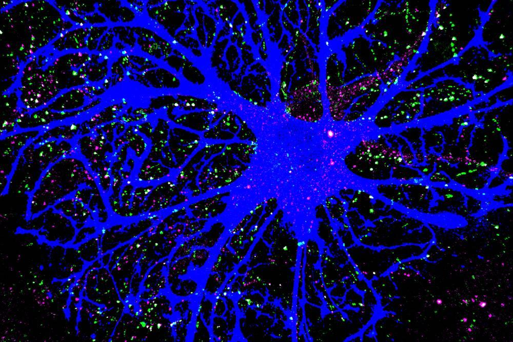

  

  Image credit: Duke University · <a href="https://medschool.duke.edu/news/star-shaped-brain-cells-orchestrate-neural-connections">Source</a>

# Hi, I'm Jessica. 

I'm a pre-med student at the University of Texas at Austin studying Chemistry and Health & Society, with a minor in Statistics and Data Science. I want to be a great doctor someday!

My interests—and the evolving landscape of medicine—increasingly pull me toward computational tools, so I'm using GitHub as a place to learn through building. This is very much a work in progress, but you'll likely find projects involving computational biology, bioinformatics, neurotech, PyMOL scripting, NLP, enzyme kinetics, public health, and whatever else I become curious about. 

## Other Interests

- **Computational and systems biology** - bioinformatics, integrative multi-omics, gene regulatory network inference, multimodal representation learning, pathway modeling, pharmacogenomics
- **Neuroscience and neurotechnology** - computational neuroscience, brain-computer interfaces, EEG/iEEG analysis, neural decoding, intracranial electrophysiology
- **Computational chemistry and molecular engineering** - molecular modeling, structure-based drug discovery, molecular transport, biomolecular/materials design
- **Health systems and policy** - health services research, healthcare operations, health economics, outcomes evaluation, quantitative health policy

___

## So, why does this pre-med have a GitHub? 

> *"For the things we have to learn before we can do them, we learn by doing them."*
> 
> Aristotle 

> *"What I cannot create, I do not understand."*
>
> Richard Feynman 

> *"The purpose of computing is insight, not numbers."*
> 
> Richard Hamming 

<!--
**JessAishwarya/JessAishwarya** is a ✨ _special_ ✨ repository because its `README.md` (this file) appears on your GitHub profile.

Here are some ideas to get you started:

- 🔭 I’m currently working on ...
- 🌱 I’m currently learning ...
- 👯 I’m looking to collaborate on ...
- 🤔 I’m looking for help with ...
- 💬 Ask me about ...
- 📫 How to reach me: ...
- 😄 Pronouns: ...
- ⚡ Fun fact: ...
-->
